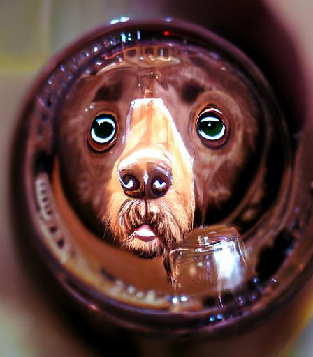

<div id="top"></div>
<!--
*** Thanks for checking out the Best-README-Template. If you have a suggestion
*** that would make this better, please fork the repo and create a pull request
*** or simply open an issue with the tag "enhancement".
*** Don't forget to give the project a star!
*** Thanks again! Now go create something AMAZING! :D
-->


<!-- PROJECT SHIELDS -->
<!--
*** I'm using markdown "reference style" links for readability.
*** Reference links are enclosed in brackets [ ] instead of parentheses ( ).
*** See the bottom of this document for the declaration of the reference variables
*** for contributors-url, forks-url, etc. This is an optional, concise syntax you may use.
*** https://www.markdownguide.org/basic-syntax/#reference-style-links
-->
[![Contributors][contributors-shield]][contributors-url]
[![Forks][forks-shield]][forks-url]
[![Stargazers][stars-shield]][stars-url]
[![Issues][issues-shield]][issues-url]
[![MIT License][license-shield]][license-url]
[![LinkedIn][linkedin-shield]][linkedin-url]

<!-- PROJECT LOGO -->
<br />
<div align="center">
  <a href="https://github.com/keifgwinn/redirector">
    
  </a>

<h3 align="center">Redirector</h3>

  <p align="center">
    Simple HTTP redirector with no dependencies
    <br />
    <a href="https://github.com/keifgwinn/redirector"><strong>Explore the docs »</strong></a>
    <br />
    <br />
    <a href="https://github.com/keifgwinn/redirector/issues">Report Bug</a>
    ·
    <a href="https://github.com/keifgwinn/redirector/issues">Request Feature</a>
  </p>
</div>


<!-- TABLE OF CONTENTS -->
<details>
  <summary>Table of Contents</summary>
  <ol>
    <li>
      <a href="#about-the-project">About The Project</a>
      <ul>
        <li><a href="#built-with">Built With go and docker</a></li>
      </ul>
    </li>
    <li>
      <a href="#getting-started">Getting Started</a>
      <ul>
        <li><a href="#prerequisites">Prerequisites</a></li>
        <li><a href="#installation">Installation</a></li>
      </ul>
    </li>
    <li><a href="#usage">Usage</a></li>
    <li><a href="#roadmap">Roadmap</a></li>
    <li><a href="#contributing">Contributing</a></li>
    <li><a href="#license">License</a></li>
    <li><a href="#contact">Contact</a></li>
    <li><a href="#acknowledgments">Acknowledgments</a></li>
  </ol>
</details>


<!-- ABOUT THE PROJECT -->
## About The Project

I wanted a very simple HTTP redirector container that could take some env variables and have no depenencies as almost everything else I could find was based on NGINX and way over the top to configure.
<p align="right">(<a href="#top">back to top</a>)</p>


### Built With

* [Go](https://go.dev/)


<p align="right">(<a href="#top">back to top</a>)</p>


<!-- GETTING STARTED -->
## Getting Started

This is an example of how you may give instructions on setting up your project locally.
To get a local copy up and running follow these simple example steps.

### Prerequisites

You need GOLANG to build and test locally and a OCI compatible container builder to build the complete container.

* [GOLANG](https://go.dev/doc/tutorial/getting-started) 
* [OCI builder](https://projectatomic.io/blog/2018/03/the-many-ways-to-build-oci-images/) 

### Installation

1. Clone the repo
   ```sh
   git clone https://github.com/keifgwinn/redirector.git
   ```
2. go build for local development
   ```sh
   go build
   ```
3. docker build .
   ```sh
   docker build .
   ```   

<p align="right">(<a href="#top">back to top</a>)</p>

<!-- USAGE EXAMPLES -->
## Usage
1. Set an ENV variable for REDIRECT_URL and REDIRECT_CODE
   ```sh
   export REDIRECT_URL = 'https://github.com/keifgwinn/redirector';
   export REDIRECT_CODE = '307';
   ```

2. Execute the program
 
   ```sh
   ./redirector
   ```

3. All in one line 
   ```sh
    REDIRECT_URL='https://github.com/keifgwinn/redirector' REDIRECT_CODE=307 ./redirector
   ```

<p align="right">(<a href="#top">back to top</a>)</p>


<!-- ROADMAP -->
## Roadmap

- [x] Configurable port to listen on

See the [open issues](https://github.com/keifgwinn/redirector/issues) for a full list of proposed features (and known issues).

<p align="right">(<a href="#top">back to top</a>)</p>


<!-- CONTRIBUTING -->
## Contributing

Contributions are what make the open source community such an amazing place to learn, inspire, and create. Any contributions you make are **greatly appreciated**.

If you have a suggestion that would make this better, please fork the repo and create a pull request. You can also simply open an issue with the tag "enhancement".
Don't forget to give the project a star! Thanks again!

1. Fork the Project
2. Create your Feature Branch (`git checkout -b feature/AmazingFeature`)
3. Commit your Changes (`git commit -m 'Add some AmazingFeature'`)
4. Push to the Branch (`git push origin feature/AmazingFeature`)
5. Open a Pull Request

<p align="right">(<a href="#top">back to top</a>)</p>

<!-- LICENSE -->
## License

Distributed under the GNU License. See `LICENSE.txt` for more information.

<p align="right">(<a href="#top">back to top</a>)</p>


<!-- CONTACT -->
## Contact

Keif Gwinn - [@keif](https://twitter.com/keif) - keif@keif.co.uk

Project Link: [https://github.com/keifgwinn/redirector](https://github.com/keifgwinn/redirector)

<p align="right">(<a href="#top">back to top</a>)</p>


<!-- ACKNOWLEDGMENTS -->
## Acknowledgments

* [This gist](https://gist.github.com/hSATAC/5343225)
* [This answer](https://codereview.stackexchange.com/a/108670)

<p align="center">(<a href="#top">back to top</a>)</p>

<!-- MARKDOWN LINKS & IMAGES -->
<!-- https://www.markdownguide.org/basic-syntax/#reference-style-links -->
[contributors-shield]: https://img.shields.io/github/contributors/keifgwinn/redirector.svg?style=for-the-badge
[contributors-url]: https://github.com/keifgwinn/redirector/graphs/contributors
[forks-shield]: https://img.shields.io/github/forks/keifgwinn/redirector.svg?style=for-the-badge
[forks-url]: https://github.com/keifgwinn/redirector/network/members
[stars-shield]: https://img.shields.io/github/stars/keifgwinn/redirector.svg?style=for-the-badge
[stars-url]: https://github.com/keifgwinn/redirector/stargazers
[issues-shield]: https://img.shields.io/github/issues/keifgwinn/redirector.svg?style=for-the-badge
[issues-url]: https://github.com/keifgwinn/redirector/issues
[license-shield]: https://img.shields.io/github/license/keifgwinn/redirector.svg?style=for-the-badge
[license-url]: https://github.com/keifgwinn/redirector/blob/master/LICENSE.txt
[linkedin-shield]: https://img.shields.io/badge/-LinkedIn-black.svg?style=for-the-badge&logo=linkedin&colorB=555
[linkedin-url]: https://linkedin.com/in/keifgwinn
[product-screenshot]: images/screenshot.png
